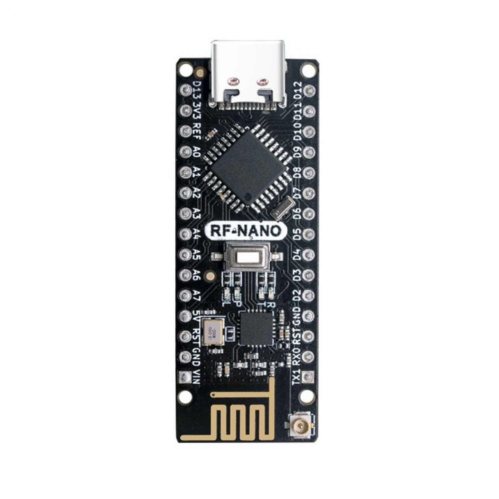
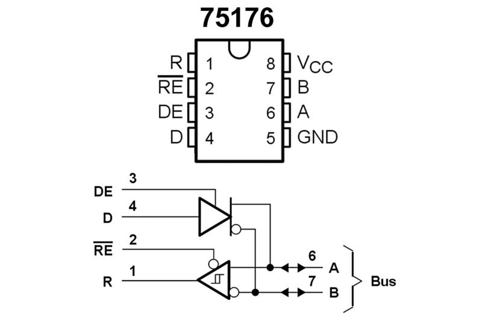
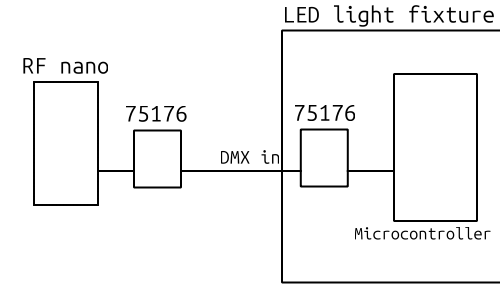
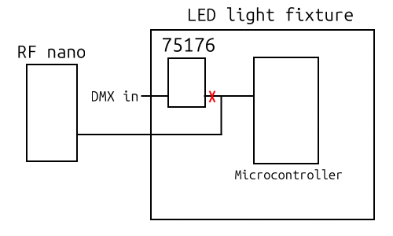

# DMX-over-nRF24
Wireless DMX system that uses RF Nano (Arduino Nano with nRF24L01)

## Transmitter

### Upload the code from Arduino IDE
Upload the transmitter code from Arduino IDE. Before that, make sure you have both libraries (RF24 and DMXSerial) in your Arduino/libraries folder.

### No DMX chip needed!
Normally, you'd have to use a DMX transceiver chip like MAX485 or SN75176 to receive the DMX signal from your DMX controller, but if you don't have the this chip and you're fine with slightly modifying your DMX controller, you can solder a wire directly to the D pin of the transceiver inside the controller. This is where the chip gets the raw signal before sending it to the DMX cable. We want that raw signal, and it will make the Arduino happy. The DMX chip should still work and you'll be able to use both the wireless and the usual wired system.

DMX transceiver pinout:

Note: SN75176 and MAX485 have the same pinout, so in the following text, all references to SN75176 are also valid for MAX485.

Find this chip in your DMX controller. You'll need three wires. I used wires from an ethernet cable, they work well.
Solder these wires like this:

|SN75176|RF Nano|
|:-----:|:-----:|
|pin 4|RX|
|pin 5|GND|
|pin 8|VCC|

Do not remove the chip, just solder onto its pins. You're basically "spying" on its input while keeping the chip functional.

## Receiver

Upload the transmitter code from Arduino IDE.

### One way to do it

If you don't want to hack your LED light, then you'll have to get a DMX transceiver chip (SN75176 or MAX485) or a ready-made DMX module.

### Hacking the LED light

RF nano --> directly to the microcontroller

In order to avoid having to use an additional DMX transceiver, we can bypass the DMX transceiver chip in the LED light entirely. 
You'll have to cut the PCB trace that leads to pin 1. After this, you will not be able to use the usual DMX cable connection, only wireless.
It is necessary to cut the PCB trace because the transceiver chip puts a bias on the serial line and interferes with the signal, so you can't just "inject" the signal from RF Nano.
Solder a wire to the trace that you cut, on the side of the gap that is not connected to the chip (see illustration).

This wire then goes to RF Nano TX.

|SN75176|RF Nano|
|:-----:|:-----:|
|pin 1|TX|
|pin 5|GND|
|pin 8|VCC|
